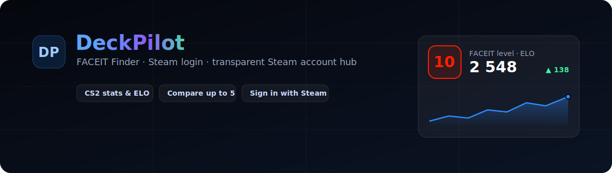
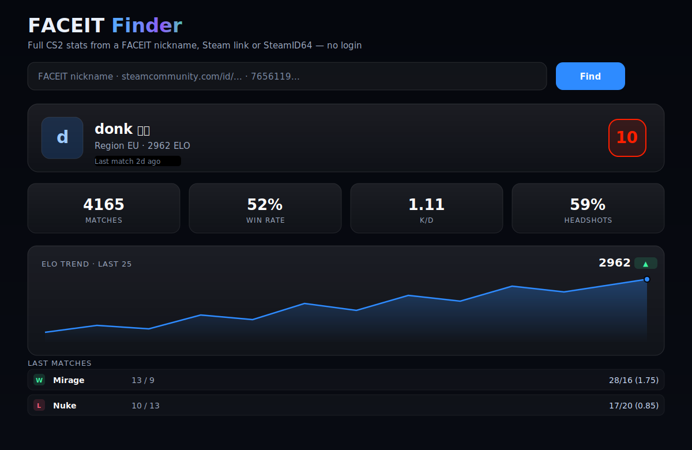
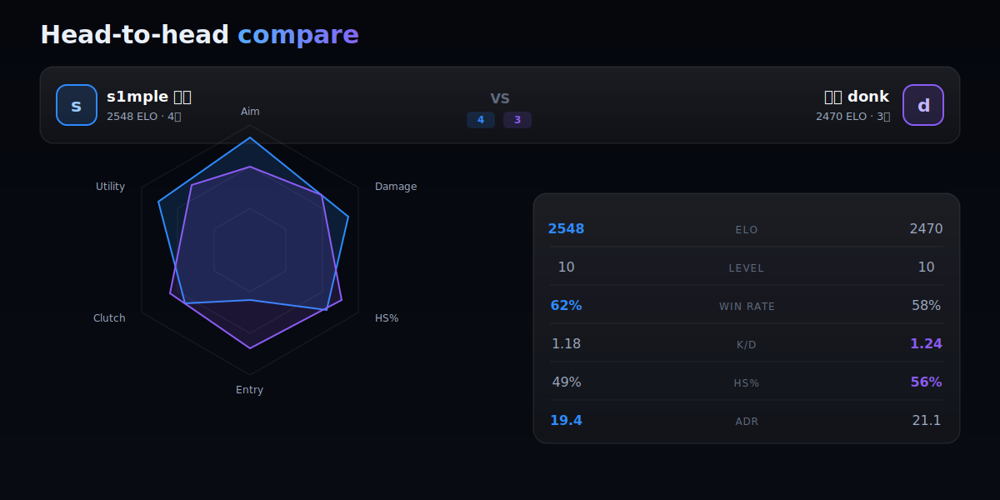

# DeckPilot

[](#changelog)
[](.github/workflows/ci.yml)
[](#license)



DeckPilot is a dark-first SaaS dashboard for transparent management of user-owned Steam accounts, selected games, activity sessions, subscriptions, billing, and admin audit workflows — plus a public, no-login **FACEIT Finder** for CS2 stats and **Sign in with Steam**.

The legacy Flask prototype is preserved under [legacy/flask](legacy/flask). The active product is the SaaS 2.0 rewrite in `apps/`.

## Product Status

Current status: `2.0.0-beta.1` release candidate for demo/closed-beta evaluation. Real Steam session automation is disabled unless official integration is explicitly configured and reviewed.

## Features

- **FACEIT Finder** (public, no login): full CS2 stats from a FACEIT nickname, Steam link or SteamID64 — level, ELO and animated ELO trend, per-map breakdown, recent matches with K/D and a lazy scoreboard, teammates, recent form, skill radar, advanced metrics, and head-to-head compare of up to 5 players. Shareable permalinks, OG cards, and an embeddable SVG badge.
- **Sign in with Steam** (Steam OpenID 2.0, passwordless) alongside username/password auth.
- Secure auth with hashed passwords, HTTP-only session cookies, server-side session revocation, CSRF protection, password reset primitives, email verification state, and rate limits.
- Encrypted Steam account credentials with owner-only access checks.
- Transparent session lifecycle via `SessionManager`, worker queue, heartbeats, and event logs.
- Game selection, account status, ban/risk information display, and activity history.
- SaaS billing with plans, limits, pending payments, provider abstraction, and idempotent webhooks.
- Admin control center with overview metrics, user search/filtering, detail drawer, payments, subscription changes, force-stop sessions, and audit logs.
- Premium Next.js dashboard UI with dark glass cards, responsive layout, loading states, toasts, drawers, modals, and command palette.
- Docker Compose deployment with FastAPI, Next.js, PostgreSQL, Redis, and worker services.

## Screenshots

### FACEIT Finder — full CS2 stats, no login



### Head-to-head compare (up to 5 players) with a skill radar



## Safety Scope

This project is a transparent account/session manager for accounts owned by the user. It must not include platform circumvention, hidden automation, credential logging, network-routing evasion, fingerprint manipulation, or mass-abuse workflows. Steam Guard codes are never stored.

Account recovery APIs create hashed, expiring tokens and are ready to connect to a transactional email provider. The local UI records recovery requests but does not send email until a provider is configured in a later release.

## Architecture

```text
apps/
  web/      Next.js 15 App Router + TypeScript + TailwindCSS + Framer Motion
  api/      FastAPI + SQLAlchemy + Alembic + secure cookie auth
  worker/   Redis/RQ worker for transparent session lifecycle jobs
packages/
  shared/   Shared product constants and future API contracts
docker/     Service Dockerfiles
docs/       Architecture, security, API, deployment, roadmap
legacy/     Preserved Flask prototype
```

See [docs/ARCHITECTURE.md](docs/ARCHITECTURE.md) for the full system overview.

## Stack

- Frontend: Next.js 15, React 19, TypeScript, TailwindCSS, Radix primitives, Framer Motion, Sonner.
- Backend: FastAPI, SQLAlchemy 2, Alembic, Pydantic Settings, passlib/bcrypt, Fernet encryption.
- Data: PostgreSQL in Docker/production, SQLite only for local tests.
- Queue: Redis + RQ.
- CI: GitHub Actions for API tests, web lint/typecheck/build, Docker config validation, npm audit, pip-audit.

## Quick Start

1. Copy environment:

```bash
cp .env.example .env
```

2. Generate secrets:

```bash
python -c "from cryptography.fernet import Fernet; print(Fernet.generate_key().decode())"
```

Set a long random `SECRET_KEY` and use the printed value as `ENCRYPTION_KEY`.

3. Start the stack:

```bash
docker compose up --build
```

4. Open:

- Web: `http://localhost:3000`
- API: `http://localhost:8000`
- API docs: `http://localhost:8000/docs`
- API live health: `http://localhost:8000/healthz`
- API readiness: `http://localhost:8000/readyz`

Seeded admin credentials come from `.env`:

```env
ADMIN_USERNAME=admin
ADMIN_PASSWORD=<your-local-admin-password>
```

## Environment

Required variables are documented in [.env.example](.env.example).

Core variables:

| Variable | Purpose |
| --- | --- |
| `APP_ENV` | `development`, `test`, or `production`. |
| `SECRET_KEY` | Session/JWT signing secret, at least 32 characters. |
| `ENCRYPTION_KEY` | Fernet key for encrypted Steam credentials. |
| `DATABASE_URL` | SQLAlchemy database URL. |
| `REDIS_URL` | Redis connection for workers. |
| `CORS_ORIGINS` | Allowed web origins. |
| `NEXT_PUBLIC_API_BASE_PATH` | Browser API base path, defaults to same-origin `/api/v1`. |
| `INTERNAL_API_URL` | Server-side Next.js API URL, for example `http://api:8000/api/v1`. |
| `SESSION_COOKIE_NAME` / `CSRF_COOKIE_NAME` | Defaults to `deckpilot_session` / `deckpilot_csrf`. |
| `COOKIE_SECURE` / `COOKIE_SAMESITE` | Production cookie safety controls. |
| `STEAM_TEST_MODE` | Uses safe mock adapters when `true`. |
| `STEAM_LOGIN_ENABLED` | Enables "Sign in with Steam" (Steam OpenID); returns to `WEB_BASE_URL`. |
| `STEAM_API_KEY` | Optional; enriches Steam persona name and FACEIT Finder Steam panel. |
| `STEAM_INTEGRATION_MODE` | `demo` or `official`; release default is safe demo mode. |
| `STEAM_OFFICIAL_LINKING_ENABLED` | Enables official linking only after reviewed configuration exists. |
| `ALLOW_DEMO_MODE_IN_PRODUCTION` | Required when production is intentionally demo/beta. |
| `BILLING_PROVIDER` | `mock` or configured payment provider. |
| `ADMIN_USERNAME` / `ADMIN_PASSWORD` | Seed admin account. |

Do not commit `.env`, database files, encryption keys, logs, or generated local state.

## Development

API:

```bash
cd apps/api
python -m pip install -r requirements.txt
python -m alembic upgrade head
python -m app.seed
python -m uvicorn app.main:app --reload --host 127.0.0.1 --port 8000
```

Web:

```bash
cd apps/web
npm ci
npm run dev -- -p 3000
```

Worker:

```bash
cd apps/worker
python app/main.py
```

## Tests

API:

```bash
python -m pytest apps/api/tests
```

Web:

```bash
cd apps/web
npm run lint
npm run typecheck
npm run build
```

Browser smoke QA, with web and API already running:

```bash
cd apps/web
npm run qa:smoke
```

Full local release gate:

```powershell
.\scripts\release-check.ps1
```

or:

```bash
./scripts/release-check.sh
```

Dependency audits:

```bash
python -m pip_audit -r apps/api/requirements.txt
cd apps/web && npm audit --audit-level=high
```

## Deployment

The default deployment target is Docker Compose:

```bash
docker compose up -d --build
```

Production checklist:

- replace all default secrets;
- set `APP_ENV=production`;
- use PostgreSQL and Redis with persistent volumes/backups;
- run `python -m alembic upgrade head` before serving traffic;
- terminate TLS at a reverse proxy or managed platform;
- review CORS origins and cookie settings;
- route `/api/*` to the API service so browser requests stay same-origin;
- configure verified payment webhooks before enabling real checkout;
- keep `BILLING_PROVIDER=mock` only in development/test. Production startup rejects mock billing.

See [docs/DEPLOYMENT.md](docs/DEPLOYMENT.md).

## Documentation

- [Architecture](docs/ARCHITECTURE.md)
- [Security](docs/SECURITY.md)
- [Deployment](docs/DEPLOYMENT.md)
- [API](docs/API.md)
- [Billing](docs/BILLING.md)
- [Session Manager](docs/SESSION_MANAGER.md)
- [Release Checklist](docs/RELEASE_CHECKLIST.md)
- [Roadmap](docs/ROADMAP.md)
- [Migration From Legacy](docs/MIGRATION_FROM_LEGACY.md)

Public trust pages are available in the web app:

- `/terms`
- `/privacy`
- `/security`
- `/status`

## Changelog

See [CHANGELOG.md](CHANGELOG.md).

## License

DeckPilot is proprietary/private software. See [LICENSE.md](LICENSE.md).
