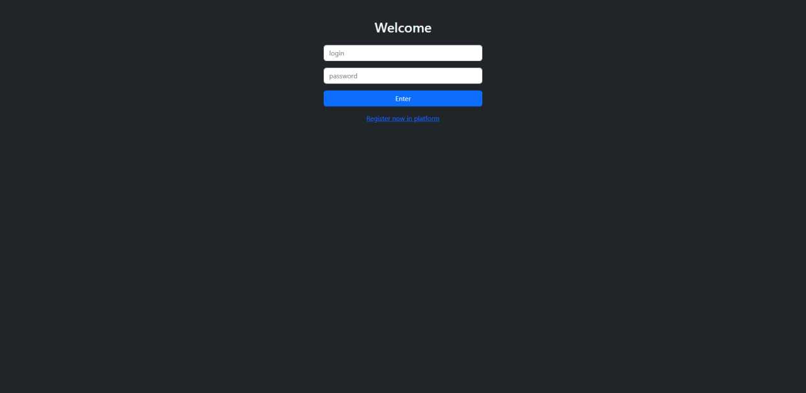
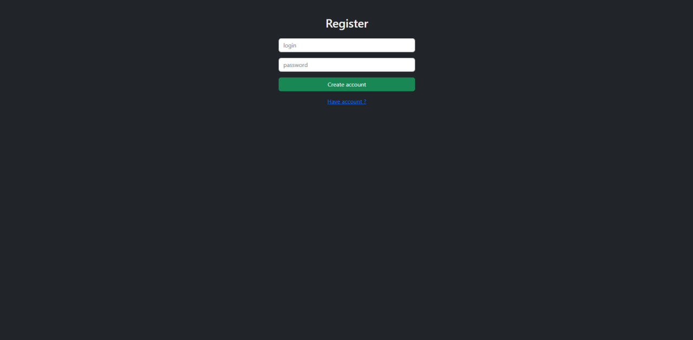
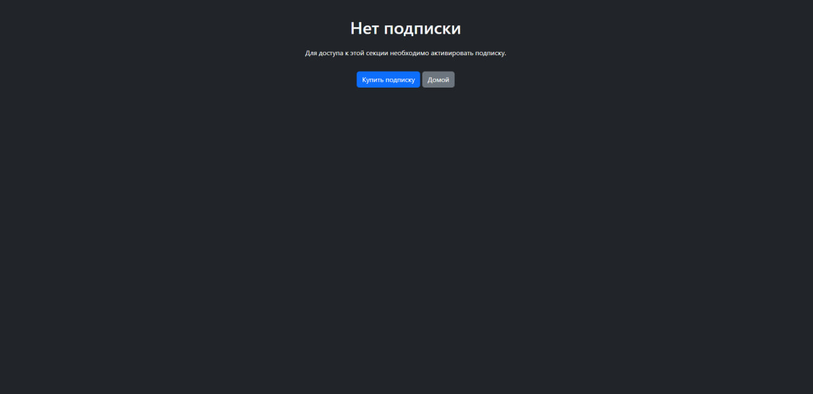
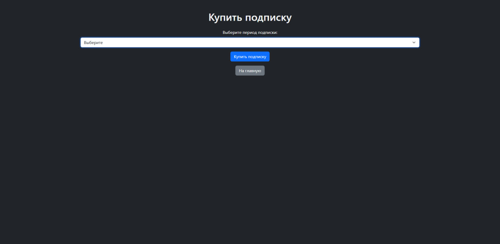
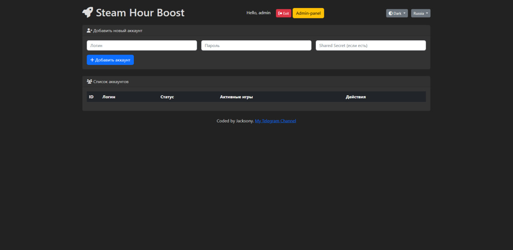
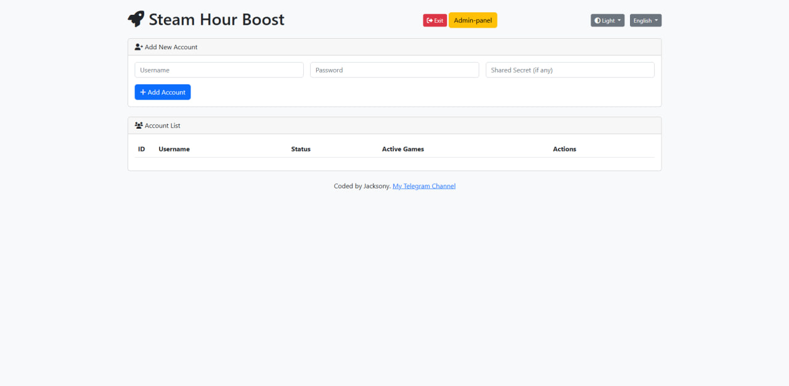
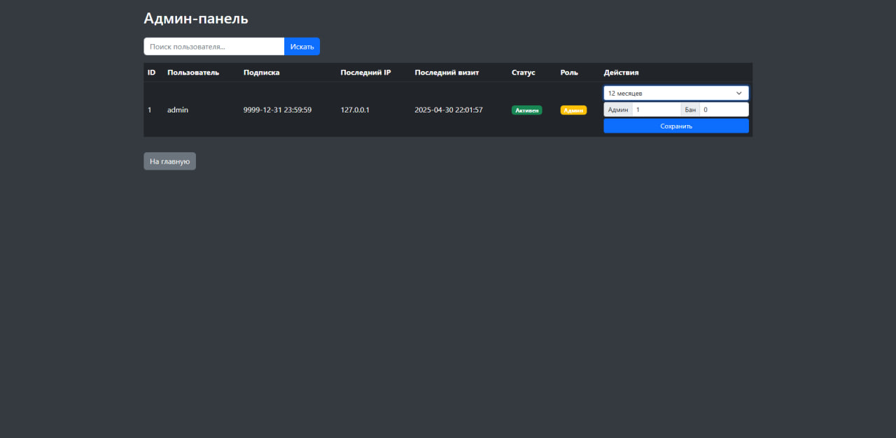

# 🎮 Steam Farming Platform (Flask + Gevent)

Этот проект — платформа для управления множеством Steam-аккаунтов с возможностью фарминга времени в играх, контроля подписки, авторизации и админ-панели.

## 🚀 Основной функционал

- 🔐 Регистрация и логин пользователей с шифрованием паролей (Fernet)
- ⏳ Подписочная модель с проверкой через декораторы
- 🎮 Добавление Steam-аккаунтов (с шифрованием логинов и паролей)
- 🕹️ Фарминг игр (games_played) с интерфейсом запуска и остановки
- 📥 Получение списка игр аккаунта через Steam API
- ⛔ Получение информации о банах аккаунта
- 👑 Админ-панель (выдача подписки, бан, управление пользователями)
- 💸 Оплата подписки через криптовалюту (Coinbase Commerce, пример)
- 🧠 SQLite + Gevent + Flask + ThreadPoolExecutor

## 📸 Скриншоты

| Интерфейс | Описание |
|----------|----------|
|  | Форма входа |
|  | Форма регестрации |
|  | Нету подписки |
|  | Покупка подписки (заглушка) |
|  | Главная страница |
|  | Главная страница (белая тема) |
|  | Админ-Панель |

## 🛠 Установка

```bash
git clone https://github.com/Jacksony100/SteamHourBooster.git
cd steam-farming-platform
python3 -m venv venv
source venv/bin/activate
pip install -r requirements.txt
